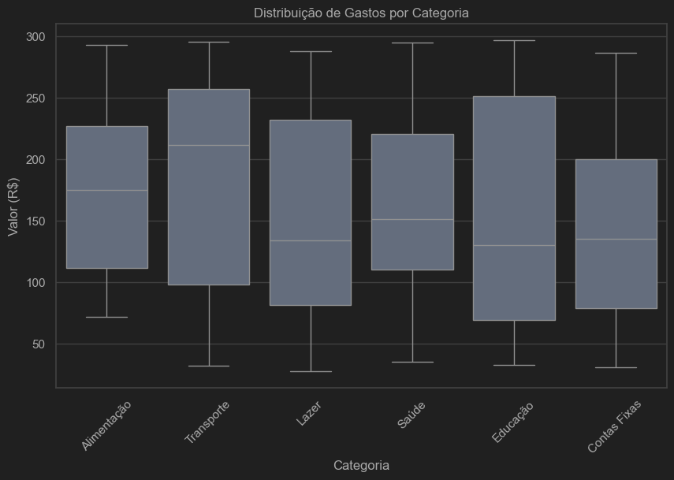
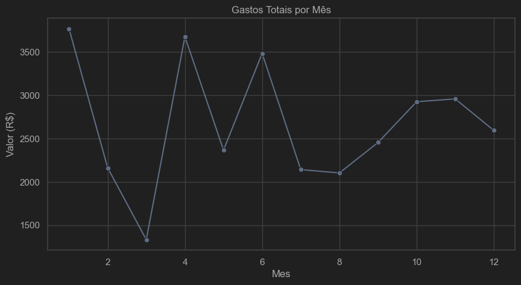

# 💰 Análise Inteligente de Despesas Pessoais

Este projeto é um pipeline **completo** de Análise e Ciência de Dados para despesas pessoais.  
Ele inclui:

✅ Limpeza e Análise Exploratória com Python  
✅ Feature Engineering  
✅ Modelo de Machine Learning para previsão de gastos  
✅ Exportação para Power BI para dashboard interativo


---

## 💡 Sobre o Projeto

O objetivo deste projeto é demonstrar um **fluxo real de Ciência de Dados**, do processamento inicial até a visualização em Power BI.

Neste projeto você encontrará:

- Carregamento de dados em Excel/CSV
- Limpeza e pré-processamento com pandas
- Análise Exploratória (EDA) com matplotlib e seaborn
- Feature Engineering (extração de ano e mês)
- Exportação para Power BI
- Modelagem preditiva com scikit-learn (Regressão Linear)
- Avaliação de modelo (MAE, RMSE)
- Salvamento do modelo treinado

---

## 🛠️ Tecnologias Usadas

- Python 3.10+
- pandas
- numpy
- matplotlib
- seaborn
- scikit-learn
- joblib
- Power BI

---

## 🚀 Como Usar

### 1️⃣ Clone o repositório
```bash
git clone https://github.com/Gabryel-Januario/Anlise-Inteligente-de-Despesas-Pessoais
cd nome-do-repo
```
### 2️⃣ Crie o ambiente virtual (opcional, recomendado)
```bash
poetry shell
```

### 3️⃣ Instale as dependências
```bash
poetry install
```
### 4️⃣ Execute o notebook
Abra o Jupyter ou sua IDE favoríta e rode o notebook célula por célula.

---

### 📈 Exemplos de Dashboards





---

### 🤝 Contribuição
Contribuições são bem-vindas!
Sinta-se à vontade para abrir Issues ou Pull Requests.

